# Livestock Management Application

**Product Design Document (PDD)**  
_Version 1.0 – 2025-07-01_

---

## 1  Document Overview

| Item     | Value                                         |
| -------- | --------------------------------------------- |
| Product  | Livestock Management Web & Mobile Application |
| Authors  | Project Owner & Design Team                   |
| Audience | Engineering, Design, QA, Stakeholders         |
| Status   | Draft                                         |

---

## 2  Product Vision

Digitise everyday farm operations so that small‑ to medium‑sized livestock farms can **record, track, and analyse** their animals’ health and performance from **any device**—without hiring a full IT team.

---

## 3  Goals & Objectives

1. **Accuracy** – Replace paper records with structured, searchable data.
2. **Insight** – Turn weight & treatment history into actionable dashboards.
3. **Compliance** – Maintain traceability for veterinary inspections.
4. **Mobility** – Work offline on the field; sync when online (phase 2).
5. **Scalability** – Multi‑farm tenancy; invite unlimited users.

---

## 4  Target Users & Personas

| Persona          | Role         | Needs                            | Pain Points                         |
| ---------------- | ------------ | -------------------------------- | ----------------------------------- |
| **Owner Owen**   | Farm owner   | High‑level KPIs, user management | No central view of livestock health |
| **Worker Wandi** | Farm hand    | Quick add of weights/treatments  | Paper notes get lost, double‑entry  |
| **Vet Vusi**     | External vet | Treatment history, dosage notes  | Hard to retrieve past data onsite   |

---

## 5  User Needs ↔ Features Mapping

| Need                             | Feature                             |
| -------------------------------- | ----------------------------------- |
| See herd status at a glance      | Dashboard metrics                   |
| Enter weight with minimal clicks | “Add Weight” quick form             |
| Track parentage & breed          | Livestock detail with mother/father |
| Manage paddocks                  | Field CRUD in Farm Mgmt             |
| Multi‑user permissions           | Farm user management & roles\*      |

\*Roles (read‑only, staff, owner) are phase 2.

---

## 6  MVP Feature List

- Email/JWT authentication
- Dashboard (3 KPI cards + recent activity)
- Livestock CRUD with: tag #, species, breed, sex, field, parents, status
- Weight recording & history table
- Treatment recording & history table
- Farm info & field CRUD
- Responsive UI (PrimeNG)

---

## 7  Future / Backlog

- Offline mode + background sync
- Photo capture & gallery per animal
- Push notifications for due treatments
- Role‑based access control
- CSV import / export

---

## 8  User Flows

```text
Login → Dashboard
Dashboard → Livestock List → [Add] / [View] Livestock
Livestock Detail → Tabs: Info | Weight History | Treatment History
Livestock Detail → +Add Weight / +Add Treatment
Dashboard → Farm Management → Tabs: Farm Info | Fields | Users
```

---

## 9  UI / UX Design References

> Full‑size PNGs live under `/Design/images/*`.

| View                 | Image                                              |
| -------------------- | -------------------------------------------------- |
| Login                | 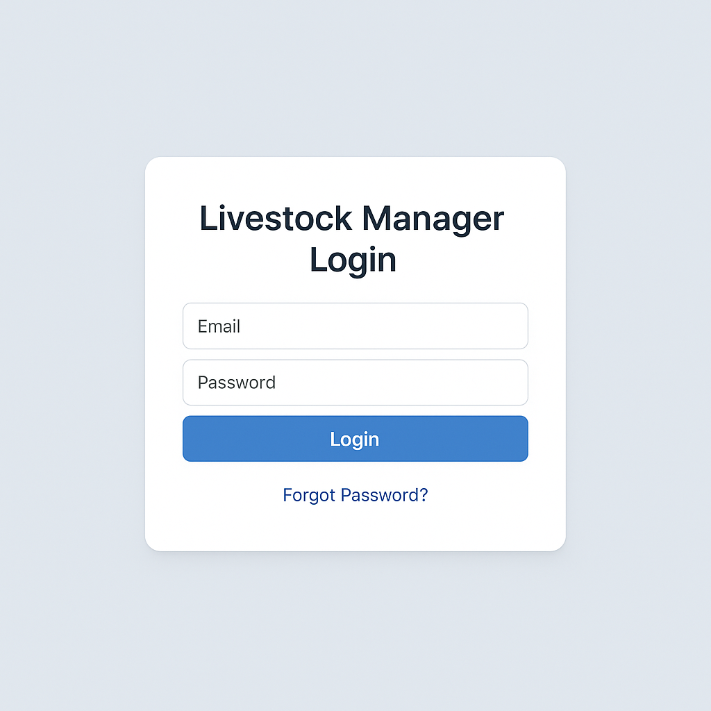                         |
| Dashboard            | 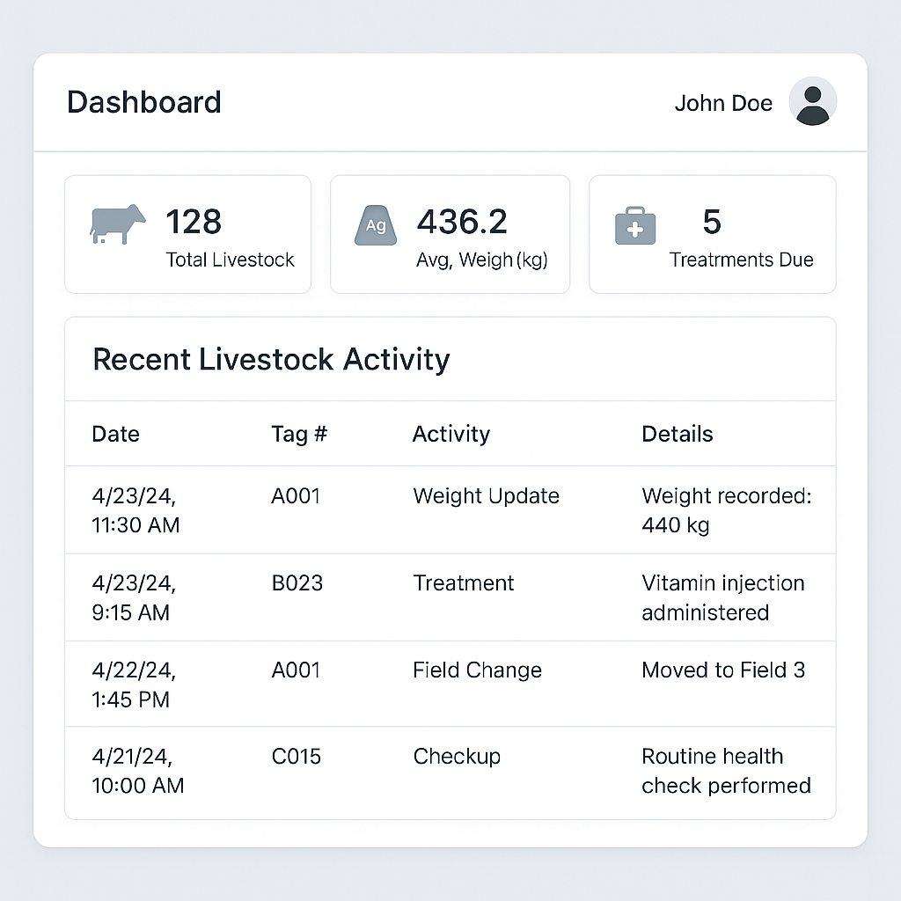                 |
| Livestock List       | 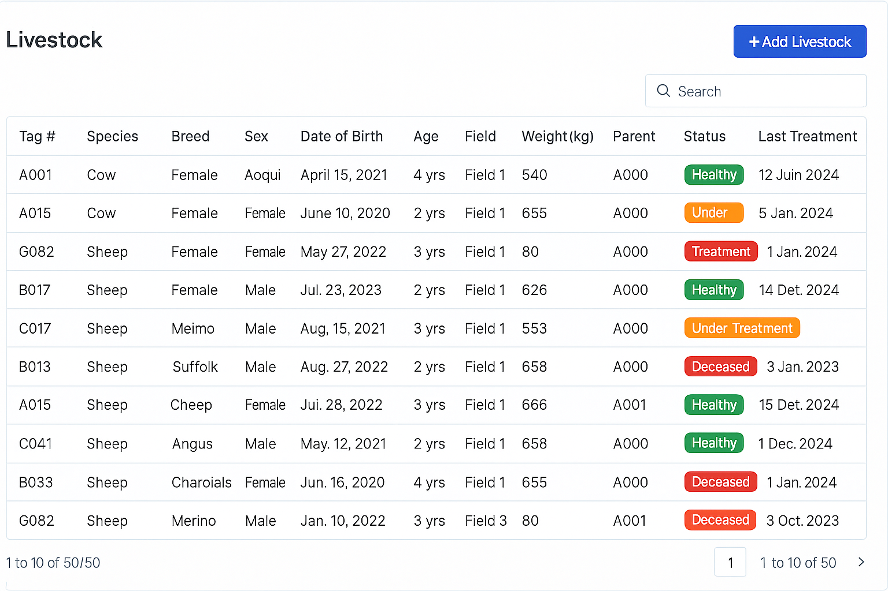     |
| Add / Edit Livestock | 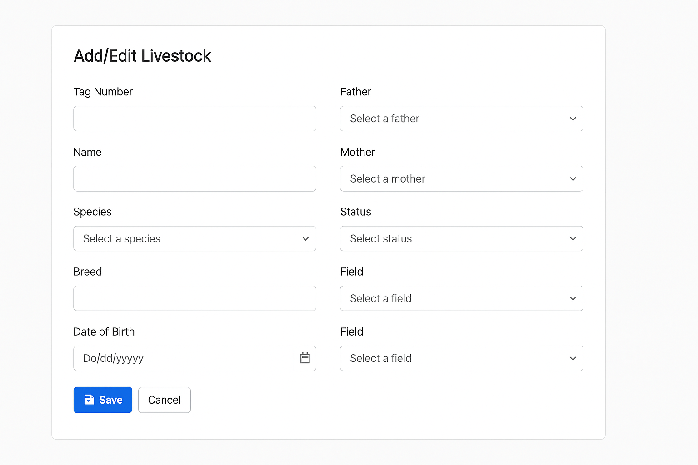         |
| Weight History       | 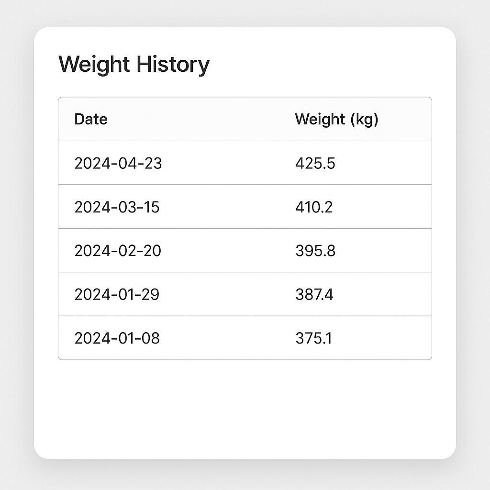       |
| Add Weight           | 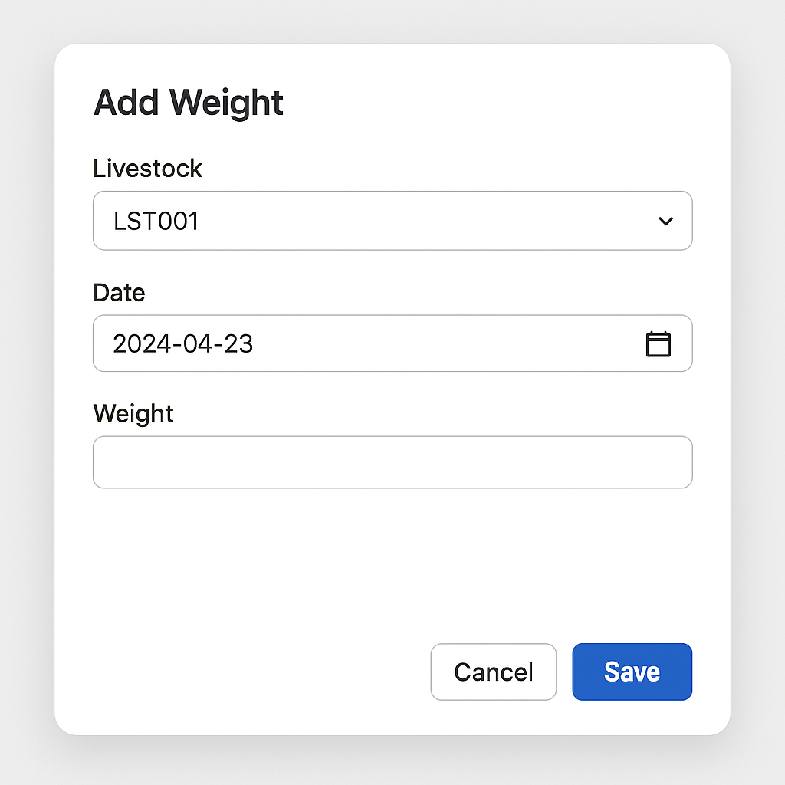               |
| Treatment History    | 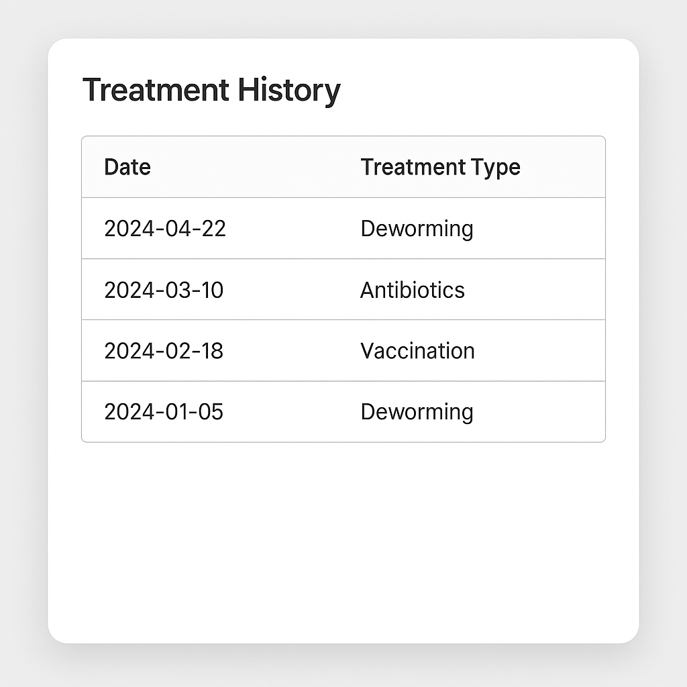 |
| Add Treatment        | 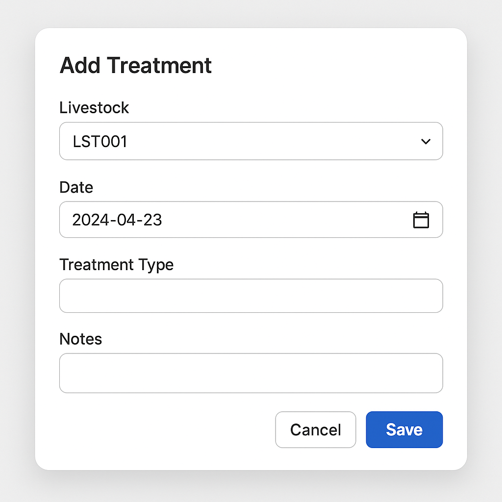         |
| User Profile         | 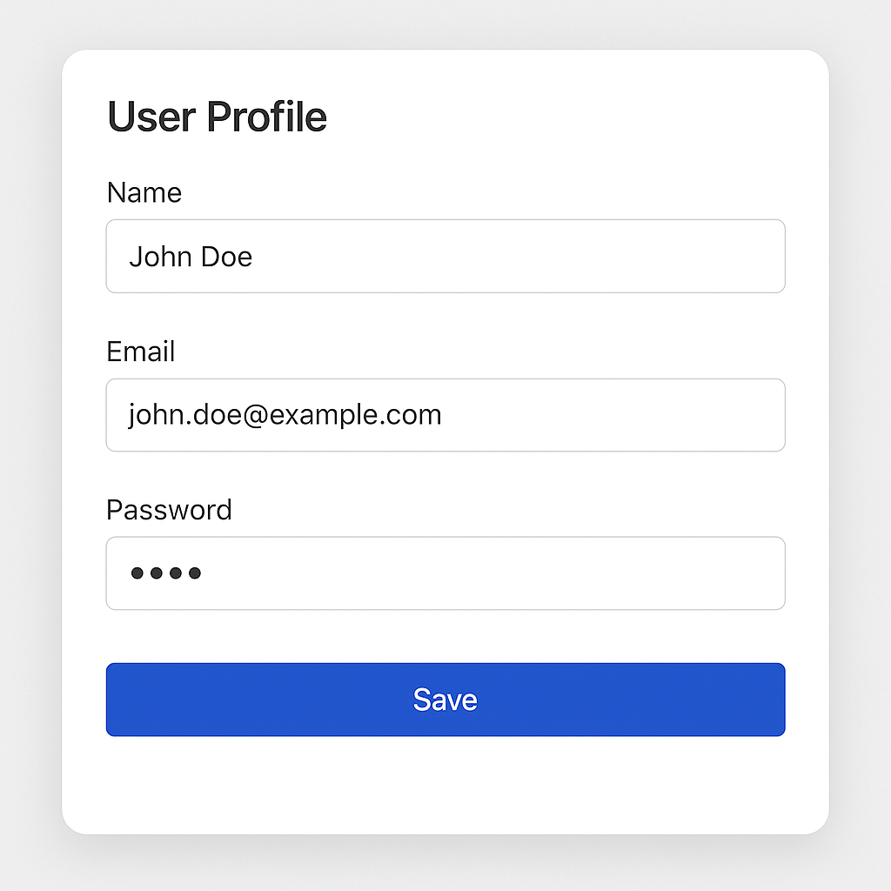                     |
| Farm Mgmt – Fields   | 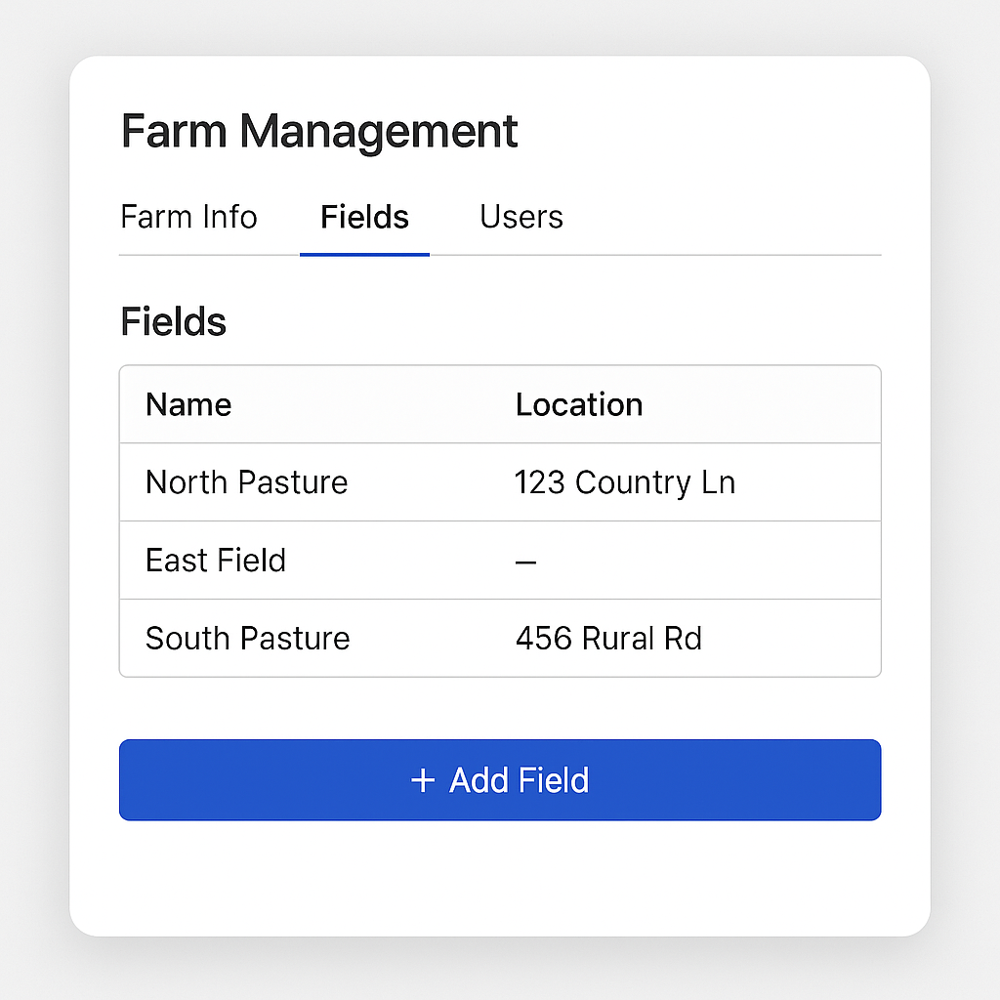             |
| Farm Mgmt – Info     | 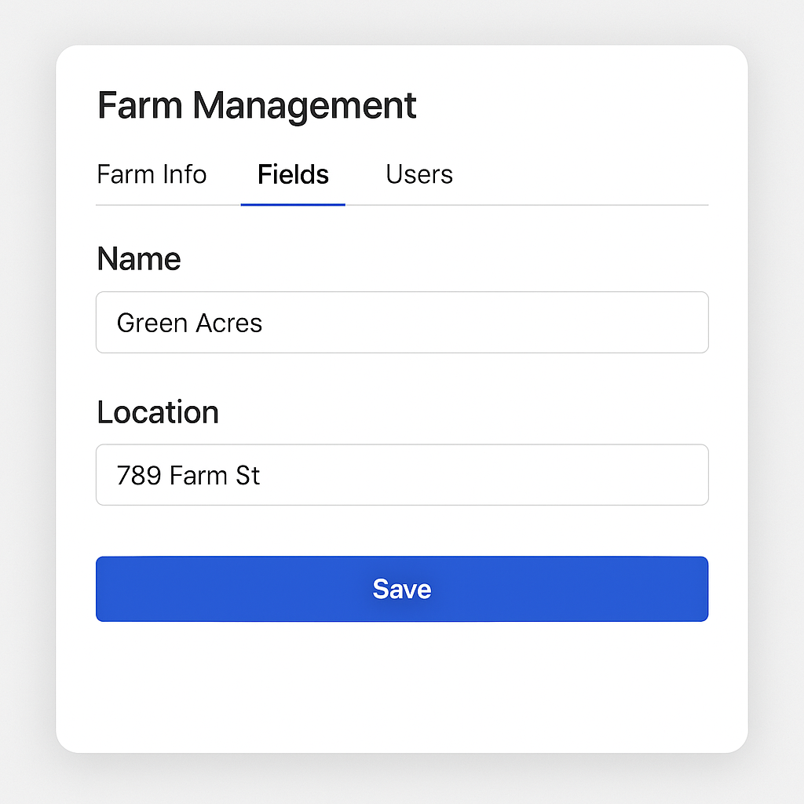                 |

Design language: PrimeNG **Lara Light Blue** theme, 8‑pt spacing, rounded‑md, single primary brand colour `#1F55E0`.

---

## 10  Non‑Functional Requirements

| Category         | Target                                               |
| ---------------- | ---------------------------------------------------- |
| **Performance**  | <300 ms avg API latency (p95 <800 ms)                |
| **Availability** | 99 % monthly                                         |
| **Security**     | OWASP top‑10 compliant, hashed passwords (bcrypt 12) |
| **Scalability**  | 10 k livestock records / farm, 100 farms / cluster   |
| **Portability**  | Dockerised services                                  |

---

## 11  Technical Constraints & Assumptions

- Single‑tenant Postgres DB per environment (Dev/Staging/Prod).
- Images stored in S3 bucket (future).
- Email delivery via SendGrid (sandbox in Dev).
- Front‑end served via Nginx container.

---

## 12  Success Metrics (KPIs)

| Metric                    | Goal                              |
| ------------------------- | --------------------------------- |
| Daily Active Users        | ≥ 10 users / farm                 |
| Avg. Records Added / Week | ≥ 20 new weight/treatment entries |
| Data Entry Time           | ≤ 30 s median for weight record   |
| Churn (90 day)            | < 15 %                            |

---

## 13  Release Plan / Roadmap

| Sprint | Scope                 | Deliverable                      |
| ------ | --------------------- | -------------------------------- |
| **0**  | Project bootstrapping | CI/CD, NestJS + Angular skeleton |
| **1**  | Auth & Dashboard      | Login page, summary API          |
| **2**  | Livestock CRUD        | List + detail forms              |
| **3**  | Weight & Treatment    | Forms + history tables           |
| **4**  | Farm Mgmt             | Fields + users                   |
| **5**  | Hardening             | Testing, performance, docs       |
| **6**  | **MVP Launch**        | Prod deploy & feedback           |

---

## 14  Risks & Mitigations

| Risk                                | Impact           | Mitigation                     |
| ----------------------------------- | ---------------- | ------------------------------ |
| Limited connectivity in rural areas | Data loss        | Implement offline cache + sync |
| User adoption (paper preference)    | Low engagement   | Provide printable exports      |
| Data accuracy                       | Compliance fines | Validation + audit trails      |

---

## 15  Open Issues

1. Role‑based permissions not yet designed.
2. Offline sync strategy TBD.
3. Vet integration API (external) under investigation.

---

## 16  Appendix – Data Dictionary (excerpt)

| Table          | Field           | Type         | Description               |
| -------------- | --------------- | ------------ | ------------------------- |
| `Livestock`    | `tagNumber`     | varchar(50)  | Ear‑tag / RFID            |
|                | `status`        | enum         | Healthy / Sick / etc.     |
| `Treatment`    | `treatmentType` | varchar(100) | Vaccine, Antibiotic, etc. |
| `WeightRecord` | `weightKg`      | float        | Measured to 0.1 kg        |

---

_End of Document_
