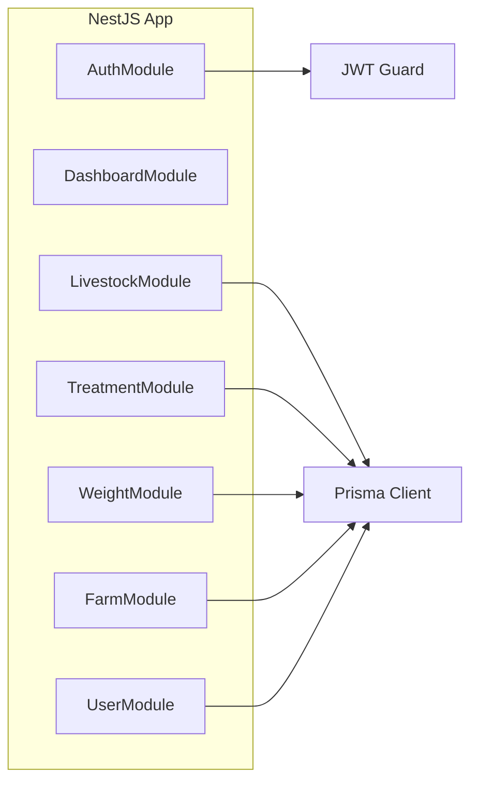
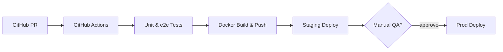

# Livestock Management Application  
**Technical Design Document (TDD)**  
*Version 1.0 – 2025-07-01*

---

## 1 Purpose  
This document describes the **technical design** of the Livestock Management Application. It is aimed at backend & frontend engineers, DevOps, QA, and architects. Functional requirements are covered in the PDD; this TDD focuses on *how* those requirements are implemented.

---

## 2 System Context

```mermaid
graph TD
  browser[Web / Mobile<br>Browser] -->|HTTPS| spa[Angular SPA<br>(PrimeNG)]
  spa -->|REST / JSON + JWT| api[NestJS API]
  api -->|Prisma ORM| postgres[(PostgreSQL)]
  api --> redis[(Redis Cache)]
  api --> mail[SendGrid]
  click api "https://docs.nestjs.com/" _blank
```

**Deployment footprint**

| Tier | Container | Port | Scaling |
|------|-----------|------|---------|
| Frontend | `nginx:latest` + SPA | `80` | horizontal via load‑balancer |
| Backend  | `node:20-alpine` + NestJS | `3000` | HPA (CPU / RPS) |
| DB       | `postgres:15-alpine` | `5432` | single primary (read‑replica backlog) |
| Cache*   | `redis:7-alpine` | `6379` | optional |

---

## 3 Architecture

### 3.1 Layered View

| Layer | Responsibility |
|-------|----------------|
| **SPA (Angular)** | Routing, view‑model, PrimeNG UI, JWT storage |
| **API Gateway (NestJS)** | Global validation, auth guard, rate‑limiting |
| **Business Modules** | Livestock, Treatment, Weight, Farm, User, Dashboard |
| **Prisma Layer** | Data‑access, migrations, transactions |
| **PostgreSQL** | Persistent relational store |

### 3.2 Module Decomposition  


Each module exposes **Controller → Service → Repository** pattern ensuring separation of HTTP transport and domain logic.

---

## 4 Data Design

Prisma schema excerpt (see repo for full):

```prisma
model Livestock {
  id            Int      @id @default(autoincrement())
  tagNumber     String   @unique
  speciesId     Int?
  species       Species? @relation(fields:[speciesId], references:[id])
  breed         String?
  sex           Sex?
  dateOfBirth   DateTime?
  status        LivestockStatus
  fieldId       Int?
  field         Field?   @relation(fields:[fieldId], references:[id])
  farmId        Int
  farm          Farm     @relation(fields:[farmId], references:[id])
  lastTreatment DateTime?
  treatments    Treatment[]
  weightRecords WeightRecord[]
  fatherId      Int? @map("father_id")
  motherId      Int? @map("mother_id")
}
```

### Indexes & Constraints
- `Livestock.tagNumber` unique index.  
- Foreign‑keys set to `ON DELETE CASCADE` where child data should vanish (weights, treatments).  
- Parentage (`fatherId`, `motherId`) use `ON UPDATE CASCADE` and `SET NULL` on delete to retain orphan records.

---

## 5 API Design

*All endpoints are versioned under `/api/v1/`.*

```yaml
GET /api/v1/livestock
GET /api/v1/livestock/{id}
POST /api/v1/livestock
PUT /api/v1/livestock/{id}
DELETE /api/v1/livestock/{id}

POST /api/v1/livestock/{id}/weight
GET  /api/v1/livestock/{id}/weights

POST /api/v1/livestock/{id}/treatment
GET  /api/v1/livestock/{id}/treatments
```

- Validation via `class-validator` DTOs.  
- Errors follow [RFC 7807](https://www.rfc-editor.org/rfc/rfc7807) Problem+JSON.  
- Swagger auto‑generated at `/api/docs`.

### Sample DTO

```ts
export class CreateWeightDto {
  @IsISO8601()
  date: string;

  @IsNumber({ maxDecimalPlaces: 1 })
  weightKg: number;
}
```

---

## 6 Security

| Concern | Measure |
|---------|---------|
| Auth | JWT (access 15 min) + refresh 7 days |
| Passwords | bcrypt 12 rounds |
| Data‑in‑transit | TLS 1.2+ |
| Rate‑limit | `@nestjs/throttler` 100 req/min/IP |
| Input validation | `class-validator`, `class‑transformer` |

---

## 7 Logging & Monitoring

- **Winston** JSON logs → stdout → CloudWatch / ELK.  
- Structured fields: `reqId`, `userId`, `module`, `level`, `msg`.  
- **Prometheus** metrics with `/metrics` endpoint, scraped every 15 s.  
- Alerts (p95 latency, error rate) → PagerDuty.

---

## 8 Deployment Pipeline



- Tags push to `:latest` and semver tags.  
- Migrations executed via `prisma migrate deploy` job before app rollout.

---

## 9 Testing Strategy
| Level | Tooling | Coverage Target |
|-------|---------|-----------------|
| Unit | Jest | ≥ 80 % functions |
| API (e2e) | SuperTest + TestContainer Postgres | CRUD flows |
| UI | Cypress component & e2e | Critical flows |
| Load | k6 scripts | 500 RPS, 10 min soak |

---

## 10 Open Technical Tasks
1. Offline‑first sync algorithm design.  
2. Role‑based access‑control middleware.  
3. Multi‑tenant database strategy (single vs schema‑per‑farm).  

---

## 11 Reference GUI Designs
| View | Image |
|------|-------|
| Dashboard |  |
| Livestock Add |  |
| Treatment Add |  |
| Weight Add |  |
| Farm Fields |  |

---

*End of Technical Design Document*
